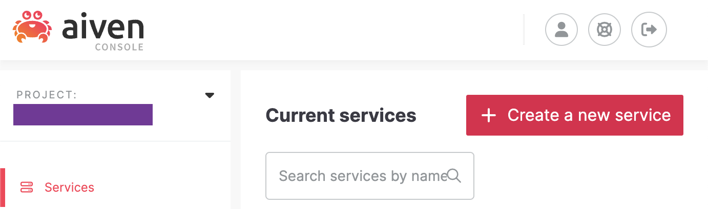
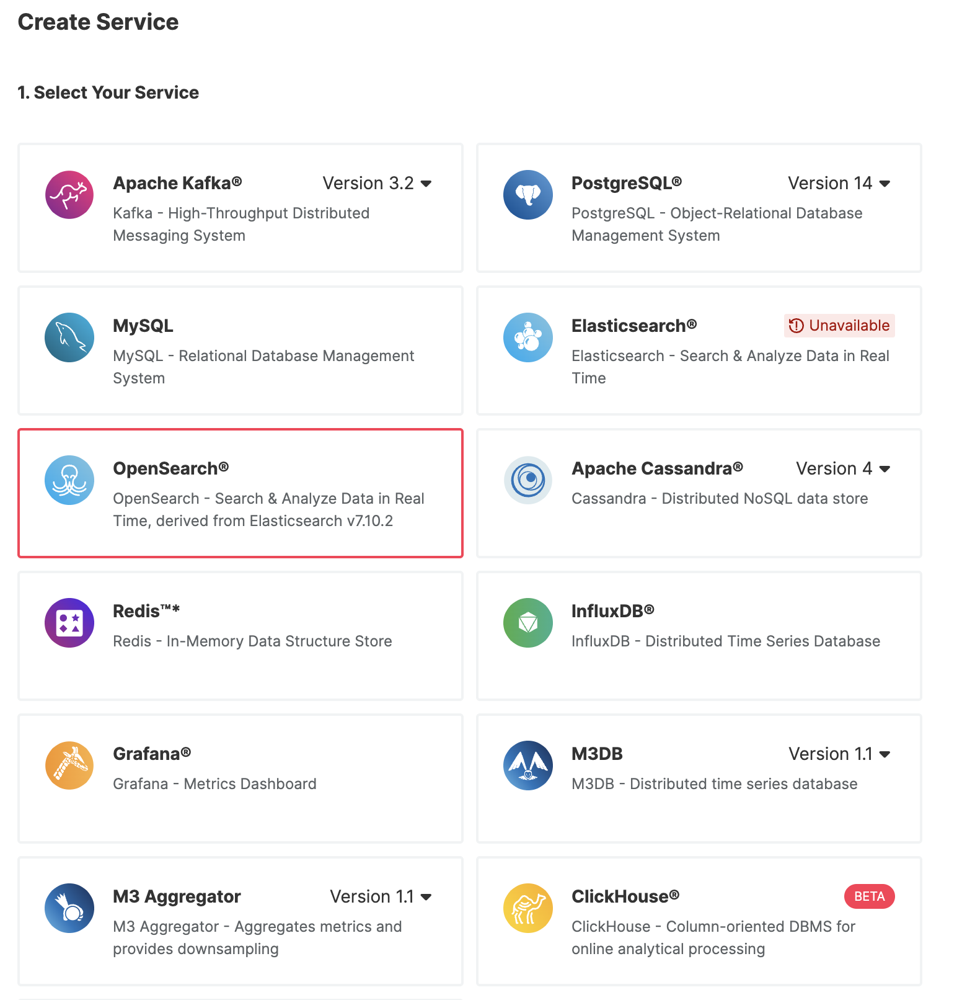
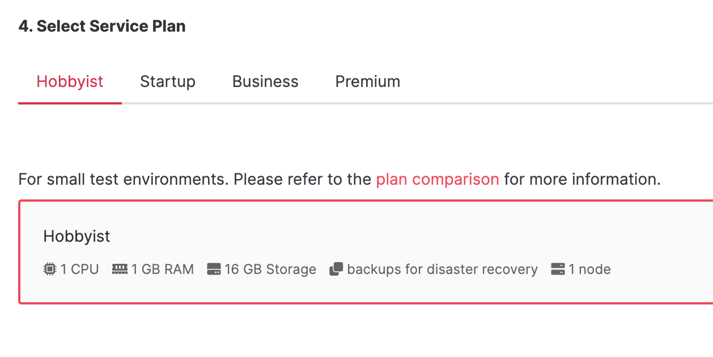
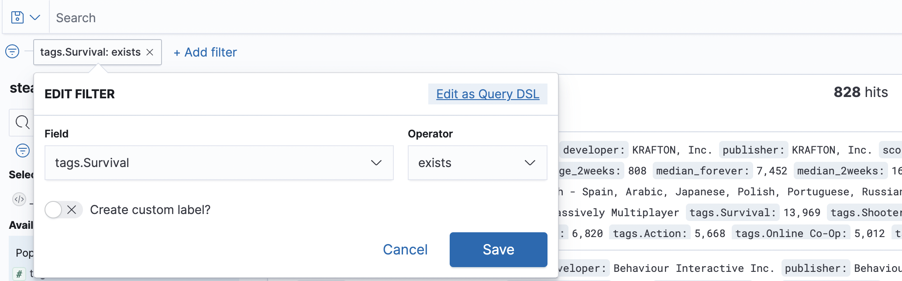
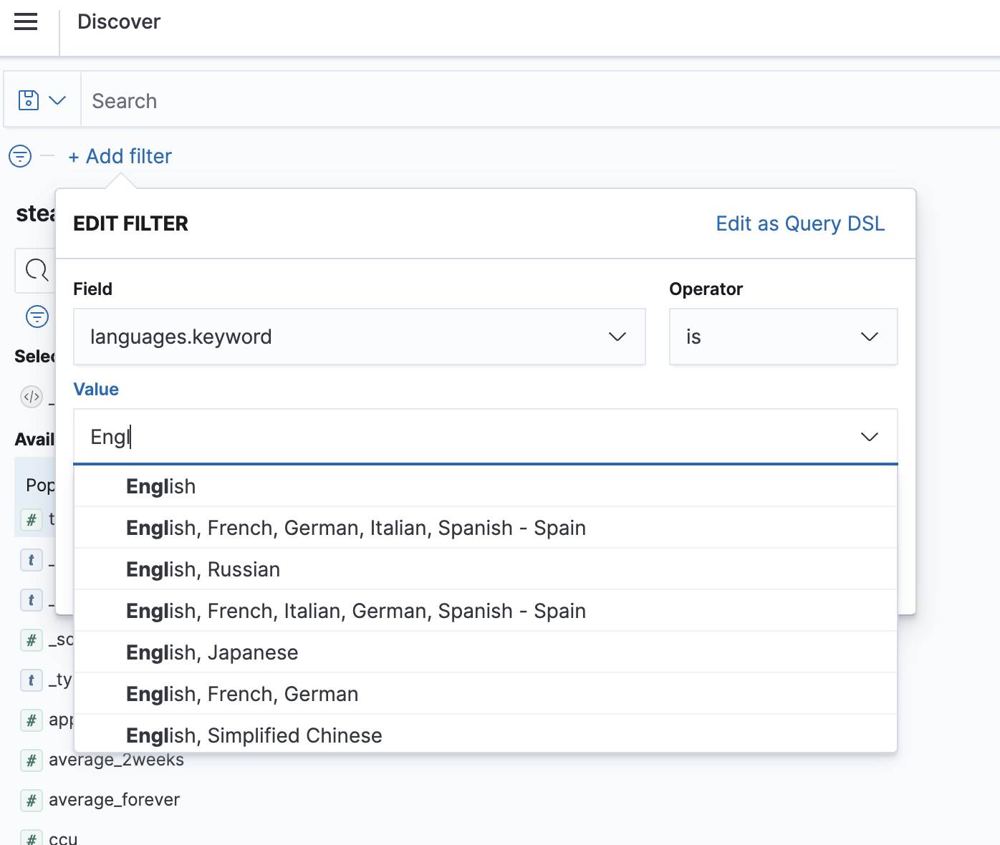
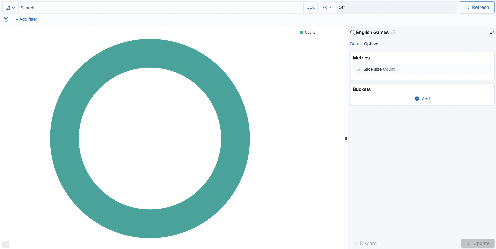
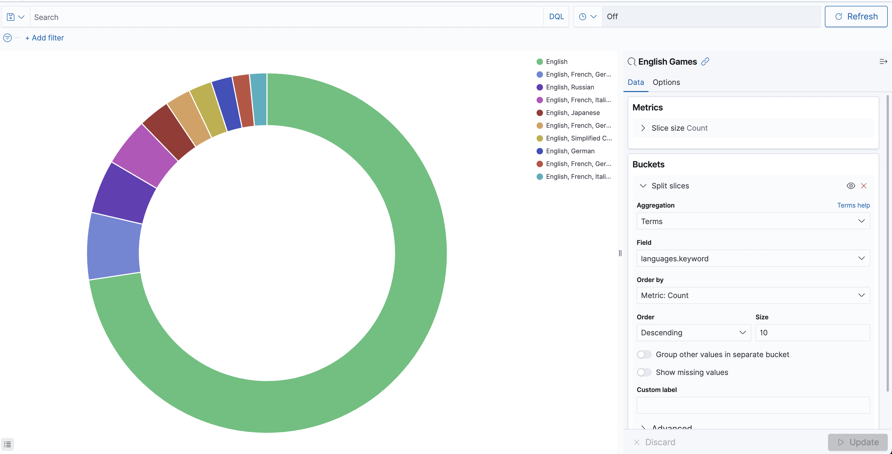
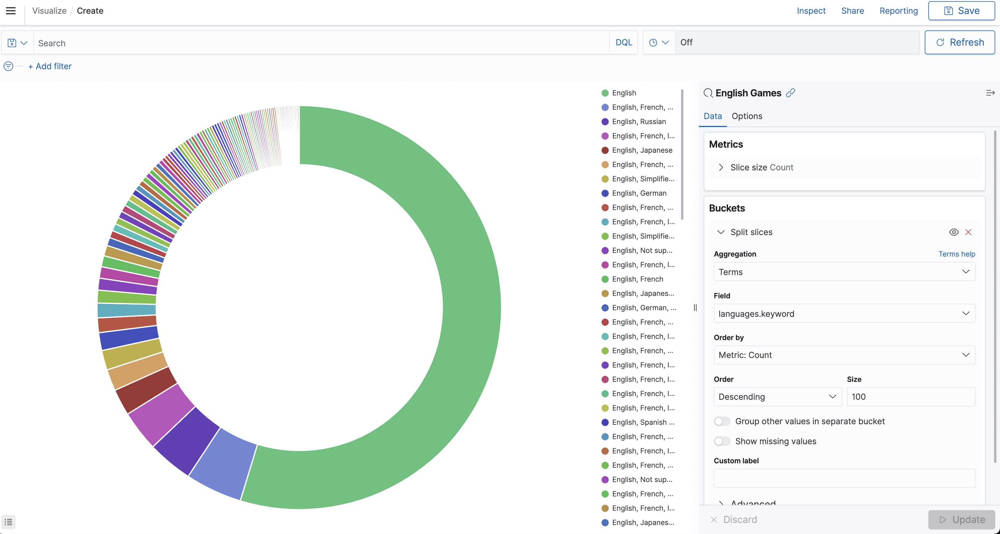

# Aiven Interview Project

The purpose of this project is to write a coding exercise for my 2022 interview with Aiven. Hooray!

Let's talk about the journey:

* v0 - The Zillow Bathtub Project: turns out getting Zillow to programmatically do what I want in order to surface the data I need to do this was more than the whole exercise. Harrumph! This is being migrated to a different project For A Later Time where I'll focusly solely on making the scraper work. Thus, no spoilers for any of the context for what this means.
* v1 - Go on Kaggle and get some NYC Bus Data, load it into Aiven's postgres offering and use Aiven's Grafana offering to build some dashboards. Drawback: this is a no-code solution to a coding exercise, so that won't do!
* v2 - The Final Version: I still want to write a way to scrape the data I need out of the Zillow API, but it turns out I'll also need a way to bulk load the data into OpenSearch whether the data is Zillow or any other source. This means that I'm focusing on bulk uploadig JSON files into the Aiven platform.

There are two segements to my write up here: the first will be the "public facing post" that I would write about as if it were a blog. The second is what I would be submitting if I were giving internal feedback on the process to a relevant team.

Some context for the blog post that follows: I try to keep them in about 10 minutes of "reading time" as implementation is always a time consuming process in and of itself, so I don't want the reading portion to be a barrier.

---

# Uploading JSON Data into Aiven via Python

Hello everyone! Today I'll be talking about how to bulk upload data into Aiven for when you need to get data from files, rather than streams, into our amazing Aiven platform! If you would like to follow along here's what you'll need:

* A development environment with Python 3.x. There will be some specific notes on which verions of Python3 to use.
* An Aiven account - a free trial will work just fine!


## The Data: Kaggle

In order to get a suitably "large, but not _that_ large" data set I made use of Kaggle. The specific data set I used is [Steam Data by Souyama](https://www.kaggle.com/datasets/souyama/steam-dataset). The code we will be working with only requires JSON documents, the contents of the JSON objects does not matter.

## Aiven Configuration

In our platform, create an OpenSearch instance. To keep costs down while building a working proof of concept, please use the **Hobbyist** tier. You will find the higher / production-sized tiers will eat through your credits rapidly if you're using a free trial.

To configure the Hobbyist OpenSearch instance there are 5 steps:

1. Click "Create a Service" when you're in the Services View:<br />

2. Select "OpenSearch" from the service list on the first step of the creation wizard:<br />

3. Select a Cloud Provider for Step 2 on the creation wizard

4. Select the region you want/need to work in for Step 3

5. Select the **Hobbyist** tier for Step 4:<br />

6. Name your service as the final step!

Once your service is running, which should only take a few moments, we can start to interact with it.

## The Code 🐍

To keep a reference of the code, please keep [this repo](README.md), which has the code itself and notes. The full code is here:

```python
from opensearchpy import OpenSearch
from genericpath import isfile
import json
import os
import time

## Notes
## 1. Connect to OpenSearch
## 2. Create index
## 3. ...
## 4. Profit, lol

host = 'HOST'
port = 24022
auth = ('USER', 'PASSWORD') 

osClient = OpenSearch(
    hosts = [{'host': host, 'port': port}],
    http_compress = True,
    http_auth = auth,
    use_ssl = True,
    verify_certs = True,
    ssl_assert_hostname = False,
    ssl_show_warn = False
)

index_name = 'steam-data-index'
index_body = {
  'settings': {
    'index': {
      'number_of_shards': 4
    }
  }
}
response = osClient.indices.create(index_name, body=index_body)
print('\nCreating index:')
print(response)

startpath = 'data/steam_dataset/'

#### Steps in the loops to upload data:
#### 1. Walk from root and find all directories and files
#### 2. For JSON files only do:
####     - append the source file name.extension
####     - upload record
####     - rinse, repeat all records in dataset
####     - rinse, repeat all JSON files in directory tree
for root, dirs, files in os.walk(startpath, topdown=False):
   for name in files:
      ## grabbing only the JSON files
      if name.endswith("json"):
        f = open(os.path.join(root,name), 'r')
        data = json.load(f)
        name_of_source_file = {"source": name}
        for key,value in data.items():
          value_with_source = value | name_of_source_file
          try:
            response = osClient.index(index = index_name, body = json.dumps(value_with_source), refresh = True)
          except:
            time.sleep(5)
            response = osClient.index(index = index_name, body = json.dumps(value_with_source), refresh=True)
          print(response)
        f.close()
```

Let's review what each segment is doing.

The very, very first thing the code does, after importing all the necessary libraries that is, is connect to the OpenSearch instance. Since this is a demo environment this is done in clear text. _When using this code in a non-demo environment, including dev and staging in addition to prod, do not hard code your credentials in this way._

```python
host = 'HOST'
port = 24022
auth = ('USER', 'PASSWORD') 

osClient = OpenSearch(
    hosts = [{'host': host, 'port': port}],
    http_compress = True,
    http_auth = auth,
    use_ssl = True,
    verify_certs = True,
    ssl_assert_hostname = False,
    ssl_show_warn = False
)
```

The next thing we do is create the index that will be storing all of our JSON documents, and print some output to console to tell us if that was successful:

```python
index_name = 'steam-data-index'
index_body = {
  'settings': {
    'index': {
      'number_of_shards': 4
    }
  }
}
response = osClient.indices.create(index_name, body=index_body)
print('\nCreating index:')
print(response)
```

Note that this code will error if you re-run the script after an index of that name is created. If you plan on running this code on the same index more than once, you should wrap that block in either a `try` or some other way to skip over the create once it exists. The error you will see will be similar to:

```
Traceback (most recent call last):
  File "/../interviews/aiven/opensearch-upload.py", line 36, in <module>
    response = osClient.indices.create(index_name, body=index_body)
  File "/opt/homebrew/lib/python3.10/site-packages/opensearchpy/client/utils.py", line 177, in _wrapped
    return func(*args, params=params, headers=headers, **kwargs)
  File "/opt/homebrew/lib/python3.10/site-packages/opensearchpy/client/indices.py", line 124, in create
    return self.transport.perform_request(
  File "/opt/homebrew/lib/python3.10/site-packages/opensearchpy/transport.py", line 407, in perform_request
    raise e
  File "/opt/homebrew/lib/python3.10/site-packages/opensearchpy/transport.py", line 368, in perform_request
    status, headers_response, data = connection.perform_request(
  File "/opt/homebrew/lib/python3.10/site-packages/opensearchpy/connection/http_urllib3.py", line 275, in perform_request
    self._raise_error(
  File "/opt/homebrew/lib/python3.10/site-packages/opensearchpy/connection/base.py", line 300, in _raise_error
    raise HTTP_EXCEPTIONS.get(status_code, TransportError)(
opensearchpy.exceptions.RequestError: RequestError(400, 'resource_already_exists_exception', 'index [steam-data-index/_u6FzketTCqqZAQB3dKTQw] already exists')
```

The most relevant portion of this error is the `400` followed by `resource_already_exists_exception` with the name of the resource.

**Now for the JSON documents themselves.**

As a reminder, this code needs to be able to grab one or more files from one or more subdirectories of a parent data directory. Since it is grabbing one or more files, I wanted to make sure to append what the file name of the specific data `source` is, which looks like this all together:

```python
startpath = 'data/steam_dataset/'

#### Steps in the loops to upload data:
#### 1. Walk from root and find all directories and files
#### 2. For JSON files only do:
####     - append the source file name.extension
####     - upload record
####     - rinse, repeat all records in dataset
####     - rinse, repeat all JSON files in directory tree
for root, dirs, files in os.walk(startpath, topdown=False):
   for name in files:
      ## grabbing only the JSON files
      if name.endswith("json"):
        f = open(os.path.join(root,name), 'r')
        data = json.load(f)
        name_of_source_file = {"source": name}
        for key,value in data.items():
          value_with_source = value | name_of_source_file
          try:
            response = osClient.index(index = index_name, body = json.dumps(value_with_source), refresh = True)
          except:
            time.sleep(5)
            response = osClient.index(index = index_name, body = json.dumps(value_with_source), refresh=True)
          print(response)
        f.close()
```

**Specific Versions of Python**

I mentioned earlier that which specific version of Python3.x you're using will matter and it actually has specifically to do with this line here:

```python
value_with_source = value | name_of_source_file
```

This concats to dictionaries together into one. This one line actually took a bit to suss out and the answer came via an expected mechanism - a [Stack Overflow post](https://stackoverflow.com/questions/38987/how-do-i-merge-two-dictionaries-in-a-single-expression). 

Succinctly, to merge dictionaries:
* In Python 3.9.0+ : `z = x | y`
* In Python 3.5.x+ : `z = {**x, **y}`
* In Python 3.4 and earlier, including Python2: you'll  need to write a method.

The Stack Overflow post itself isn't recent, originally published in 2008, but the responder who made the original version of the answer has been keeping it updated with a last update of only a few days ago! Amazing and greatly appreciated.

**Sleepy Code**

What's with the `try` block and a `sleep` statement? When getting the upload working, every so often a timeout appears like thus:

```
Traceback (most recent call last):
  File "/opt/homebrew/lib/python3.10/site-packages/urllib3/connectionpool.py", line 449, in _make_request
    six.raise_from(e, None)
  File "<string>", line 3, in raise_from
  File "/opt/homebrew/lib/python3.10/site-packages/urllib3/connectionpool.py", line 444, in _make_request
    httplib_response = conn.getresponse()
  File "/opt/homebrew/Cellar/python@3.10/3.10.6_2/Frameworks/Python.framework/Versions/3.10/lib/python3.10/http/client.py", line 1374, in getresponse
    response.begin()
  File "/opt/homebrew/Cellar/python@3.10/3.10.6_2/Frameworks/Python.framework/Versions/3.10/lib/python3.10/http/client.py", line 318, in begin
    version, status, reason = self._read_status()
  File "/opt/homebrew/Cellar/python@3.10/3.10.6_2/Frameworks/Python.framework/Versions/3.10/lib/python3.10/http/client.py", line 279, in _read_status
    line = str(self.fp.readline(_MAXLINE + 1), "iso-8859-1")
  File "/opt/homebrew/Cellar/python@3.10/3.10.6_2/Frameworks/Python.framework/Versions/3.10/lib/python3.10/socket.py", line 705, in readinto
    return self._sock.recv_into(b)
  File "/opt/homebrew/Cellar/python@3.10/3.10.6_2/Frameworks/Python.framework/Versions/3.10/lib/python3.10/ssl.py", line 1274, in recv_into
    return self.read(nbytes, buffer)
  File "/opt/homebrew/Cellar/python@3.10/3.10.6_2/Frameworks/Python.framework/Versions/3.10/lib/python3.10/ssl.py", line 1130, in read
    return self._sslobj.read(len, buffer)
TimeoutError: The read operation timed out

During handling of the above exception, another exception occurred:

Traceback (most recent call last):
  File "/opt/homebrew/lib/python3.10/site-packages/opensearchpy/connection/http_urllib3.py", line 249, in perform_request
    response = self.pool.urlopen(
  File "/opt/homebrew/lib/python3.10/site-packages/urllib3/connectionpool.py", line 787, in urlopen
    retries = retries.increment(
  File "/opt/homebrew/lib/python3.10/site-packages/urllib3/util/retry.py", line 525, in increment
    raise six.reraise(type(error), error, _stacktrace)
  File "/opt/homebrew/lib/python3.10/site-packages/urllib3/packages/six.py", line 770, in reraise
    raise value
  File "/opt/homebrew/lib/python3.10/site-packages/urllib3/connectionpool.py", line 703, in urlopen
    httplib_response = self._make_request(
  File "/opt/homebrew/lib/python3.10/site-packages/urllib3/connectionpool.py", line 451, in _make_request
    self._raise_timeout(err=e, url=url, timeout_value=read_timeout)
  File "/opt/homebrew/lib/python3.10/site-packages/urllib3/connectionpool.py", line 340, in _raise_timeout
    raise ReadTimeoutError(
urllib3.exceptions.ReadTimeoutError: HTTPSConnectionPool(host='{opensearch-service-name}-{aiven-project-name}.aivencloud.com', port=24022): Read timed out. (read timeout=10)

During handling of the above exception, another exception occurred:

Traceback (most recent call last):
  File "/Volumes/home/Work/code/interviews/aiven/opensearch-upload.py", line 82, in <module>
    response = osClient.index(index = index_name, body = json.dumps(value_with_source), refresh = True)
  File "/opt/homebrew/lib/python3.10/site-packages/opensearchpy/client/utils.py", line 177, in _wrapped
    return func(*args, params=params, headers=headers, **kwargs)
  File "/opt/homebrew/lib/python3.10/site-packages/opensearchpy/client/__init__.py", line 351, in index
    return self.transport.perform_request(
  File "/opt/homebrew/lib/python3.10/site-packages/opensearchpy/transport.py", line 407, in perform_request
    raise e
  File "/opt/homebrew/lib/python3.10/site-packages/opensearchpy/transport.py", line 368, in perform_request
    status, headers_response, data = connection.perform_request(
  File "/opt/homebrew/lib/python3.10/site-packages/opensearchpy/connection/http_urllib3.py", line 263, in perform_request
    raise ConnectionTimeout("TIMEOUT", str(e), e)
opensearchpy.exceptions.ConnectionTimeout: ConnectionTimeout caused by - ReadTimeoutError(HTTPSConnectionPool(host='{opensearch-service-name}-{aiven-project-name}.aivencloud.com', port=24022): Read timed out. (read timeout=10))
```

Looking at the messages, we can see these are read and connection timeout messages. In practice, they happened every 50-100 records or so, and the sleep statement allows the program to re-connect and try again after pausing for a few seconds.

## Looking At The Data

Now that we have the data in the platform, let's take a look at an example record in full:

```
{
  "_index": "steam-data-index",
  "_type": "_doc",
  "_id": "nofBPYMBRPW5wlYPgXnd",
  "_version": 1,
  "_score": 0,
  "_source": {
    "appid": 578080,
    "name": "PUBG: BATTLEGROUNDS",
    "developer": "KRAFTON, Inc.",
    "publisher": "KRAFTON, Inc.",
    "score_rank": "",
    "positive": 1140088,
    "negative": 888932,
    "userscore": 0,
    "owners": "50,000,000 .. 100,000,000",
    "average_forever": 22351,
    "average_2weeks": 808,
    "median_forever": 7452,
    "median_2weeks": 167,
    "price": "0",
    "initialprice": "0",
    "discount": "0",
    "ccu": 363124,
    "languages": "English, Korean, Simplified Chinese, French, German, Spanish - Spain, Arabic, Japanese, Polish, Portuguese, Russian, Turkish, Thai, Italian, Portuguese - Brazil, Traditional Chinese, Ukrainian",
    "genre": "Action, Adventure, Free to Play, Massively Multiplayer",
    "tags": {
      "Survival": 13969,
      "Shooter": 11785,
      "Multiplayer": 10134,
      "Battle Royale": 9981,
      "FPS": 7728,
      "PvP": 7296,
      "Third-Person Shooter": 6820,
      "Action": 5668,
      "Online Co-Op": 5012,
      "Tactical": 4722,
      "Co-op": 4010,
      "First-Person": 3772,
      "Strategy": 2905,
      "Early Access": 2715,
      "Competitive": 2160,
      "Third Person": 2110,
      "Team-Based": 1858,
      "Difficult": 1567,
      "Simulation": 1213,
      "Stealth": 1123
    },
    "source": "steam_spy_detailed.json"
  }
}
```

Looking at some of the fields we can see some of the properties of this particular game including its name, developer, publisher, some data regarding its rank compared to other games, and so on. We can see that the languages are listed as a comma separated list and the genre tags are listed out. If we wanted to see how many games in the uploaded set were tagged as Survival, we could filter the results to see if the Survival tag exists (the numerical value isn't relevant):



Of 5427 games uploaded, 828 or ~16% are Survival games.

**What about languages?**

When we looked at a record previously, we could see that languages are a comma separated list paired with the language key like so:

```
"languages": "English, Korean, Simplified Chinese, French, German, Spanish - Spain, Arabic, Japanese, Polish, Portuguese, Russian, Turkish, Thai, Italian, Portuguese - Brazil, Traditional Chinese, Ukrainian"
```

In order to filter for English games, I create a filter and set it to `languages.keyword is English` in the UI:



A drawback to this approach is that the query currently only returns the records where the only value in `languages` is `English`. So if the game is in English and other languages, that's not returned. I can expand the search to include all games that are in English as well as English and other languages by editing the query. I do this by using "Edit as Query DSL" and put `*` for wildcards around `English`:

```
{
  "query": {
    "query_string": {
      "query": "*English*",
      "fields": [
        "languages.keyword"
      ]
    }
  }
}
```
When you save the query the results should refresh, but if not just click Refresh to the right of the search bar. In this case, we now have 5304 records. 

I can also create a chart of the languages, but due to the way the data is structured I can't quite get the answer to the question I'd like to ask. The question I'd like to ask is "what languages are the games in and how many in each language?" As a simplified specific example, if the data set had 5 records in English only, 3 in English and Ukrainian, and 3 in Ukrainian only, what I'd like is a bar chart with 8 records for English and 6 records for Ukranian.

One of the reasons this can't be achieved with this particular set is because `languages` is typed as `keyword` and not `text`. `keyword` data in this case is stored as entire, unparsed / analyzed, string. This means that as far as OpenSearch is concerned, `English`, `English, Ukrainian`, and `Ukrainian` are distinct separate "things". If instead `languages` was `text`, then the field would be analyzed before it was stored and `English` -> `English`, `English, Ukrainian` -> `English`, `Ukrainian`, `Ukrainian` -> `Ukrainian`. For a relevant analysis on Keyword vs Text, please check out [this blog post on Code Curated](https://codecurated.com/blog/elasticsearch-text-vs-keyword/).

That said, let's visualize the data that we have! Go to the hamburger menu and click `Visualize -> Create New Visualizaton -> Pie` and select the `English Games` saved query. At first you should see this:



In order to how many games have additional languages, we'll need to create buckets for the aggregated data. Under buckets click `Add -> Split Slices`. Now we can take a look at the Terms in `languages.keyword` like so:



Here, the language buckets are organized by count. English only comes in first, followed "English, French, German, Italian, Spanish - Spain", and then the remaining 8 buckets. If we increase the size then the pie graph is split into more pieces. For exmaple if Size is 100 then the first 100 are returned and graphed:



In this case we can see much thinner slices for the less frequent language combinations. In each case we can see that while there are 1492 English (only) games, that in the case of 10 buckets that accounds for 72.6% of the records graphed and with 100 buckets it is 54.71% due to how many more records are included.


## Signing off, for now ;)

This unfamiliar (to me) data set was a fun one to explore! The data set itself is relatively large and the JSON objects have several fields that we can discuss and analyze. The issues with `keyword` vs `text` also serve as a reminder to keep in mind a few things when designing your data objects:

* What information is trying to be understood with this data?
* What tool(s) are going to be used to store the data?
* What tool(s) are going to be used to interpret the data?

You will need to keep all of these in mind so that you can store your data without accidentally creating redundancies or other storage issues and that the data is formatted to match what the tool(s) that will be used to analyze and interpret it are expecting. You also need to be aware of what questions or types of questions will be asked of the data so that those answers are easy to surface and have enough surrounding context to be meaningful.

Keeping all of that in mind I encourage you to create a few more visualizations of the questions you'd like to ask of this data and then put them together on a dashboard that communicates 3-5 features of the games available that you find interesting. And as always, stay tuned to our blog for more snippets and samples!


---

## Internal Feedback on Data Uploading and Trying the Trial

### TLDR: We Should Provide "Low Code" and "No Code" Options

I think that it's great that we offer some pre-populated data - that gives people the ability to start to tinker with OpenSearch and see how to use their free trial independent of generating data. That said, some people might already have data that they can populate for what they specifically want to try to test for - some of it might involve streaming the data in, which we're already set up to do, but some of it might involve a batch upload of their own demo or staging data. This is something we're not currently suited for without someone taking on this particular exercise - writing a data uploader. Specifically getting the data into a format that the bulk endpoint would consume proved to be a bit of a chore. A work around is to iterate and upload each individual document on its own as I did here, which did encounter the workaround-able connection timeout + read timeout issue.

Also, depending on the teams invovled with trying and using our product, the individuals tasked with uploading vs analyzing vs generating the data might not be the same teams. This means that the people generating the data in particular might not have a coding backgroung, but an analytics one. Even though the dev and/or ops teams might be able to stream some data into our platform on their behalf, that's not the strongest user experience for them.

We should provide two things:

* A "no code" solution to upload the data: for people who need to make use of and interpret the data that don't have a programming background.
* A "low code" solution, where broadly applicable and tested demo solutions like this one: for people to utilize in their projects.

I think we should be very active with this in our efforts, sharing in our communities and encouraging any ambassadors or super users to make use of the code samples in what they build that is public facing. We could offer swag and Internet Points for the most interesting combination of code use and idea.